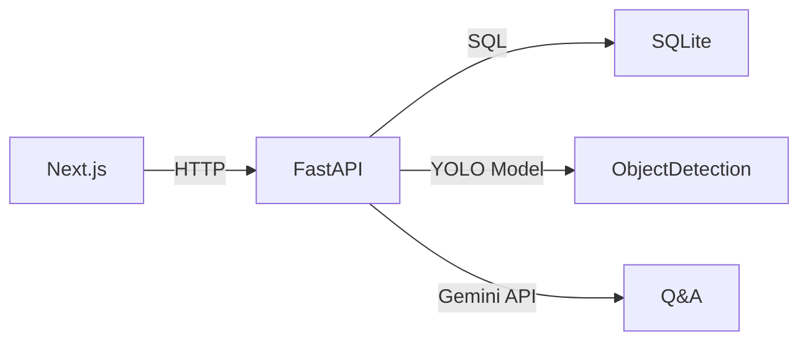

# AI Image Analysis & Q&A Platform

A full-stack AI web application for object detection using YOLO and conversational Q&A powered by Gemini 2.5 Flash.

## Features

- **User Authentication**: Secure login/signup with JWT tokens and password hashing
- **Image Upload & Object Detection**: Upload images and detect objects using YOLO12x model
- **Results Visualization**: View annotated images with bounding boxes and sortable detection tables
- **AI-Powered Q&A**: Ask questions about detected objects using Gemini 2.5 Flash
- **Responsive Design**: Mobile-friendly UI that matches the provided design specifications

## Tech Stack

### Frontend
- **Next.js 16** - React framework with App Router
- **TypeScript** - Type-safe development
- **Tailwind CSS** - Utility-first styling
- **Axios** - HTTP client
- **Lucide React** - Icon library

### Backend
- **FastAPI** - Modern Python web framework
- **SQLAlchemy** - ORM for database operations
- **JWT** - Secure authentication
- **Ultralytics YOLO** - Object detection model
- **Google Gemini** - AI-powered conversational assistant

### Database
- **SQLite** - Lightweight database (can be replaced with PostgreSQL for production)

## Architecture


## Prerequisites

- Docker
- Node.js 22+
- Python 3.12+

## Quick Start with Docker

1. **Clone the repository**
   ```bash
   git clone <repository-url>
   cd image-analysis-yolo
   ```

2. **Set up environment variables**
   
   Create `backend/.env`:
   ```env
   DATABASE_URL=sqlite:///./data.db
   SECRET_KEY=your-secret-key-here-change-in-production
   GEMINI_API_KEY=your-gemini-api-key-here
   ```

   Create `frontend/.env`:
   ```env
   NEXT_PUBLIC_API_URL=http://localhost:8000
   ```

3. **Run with Docker Compose**
   ```bash
   docker compose up --build
   ```

4. **Access the application**
   - Frontend: http://localhost:3000
   - Backend API: http://localhost:8000
   - API Documentation: http://localhost:8000/docs

## Local Development

### Backend Setup

1. Navigate to backend directory:
   ```bash
   cd backend
   ```

2. Create and activate virtual environment:
   ```bash
   python -m venv .venv
   .venv\Scripts\activate  # Windows
   source .venv/bin/activate  # Linux/Mac
   ```

3. Install dependencies:
   ```bash
   pip install -r requirements.txt
   ```

4. Create `.env` file with required variables

5. Run the server:
   ```bash
   uvicorn main:app --reload --host 0.0.0.0 --port 8000
   ```

### Frontend Setup

1. Navigate to frontend directory:
   ```bash
   cd frontend
   ```

2. Install dependencies:
   ```bash
   npm install
   ```

3. Create `.env` file with API URL

4. Run development server:
   ```bash
   npm run dev
   ```

## API Endpoints

### Authentication
- `POST /api/auth/signup` - Create new user account
- `POST /api/auth/login` - Login and receive JWT token
- `GET /api/auth/me` - Get current user info (requires auth)

### Object Detection
- `POST /api/detect` - Upload image and get detection results (requires auth)
  - Returns: annotated image and detection data

### Q&A
- `POST /api/chat` - Ask questions about detection results (requires auth)
  - Body: `{ question, detections, image_url }`

## Project Structure

```
.
├── backend/
│   ├── main.py            # FastAPI app entry point
│   ├── auth.py            # JWT authentication logic
│   ├── detection.py       # YOLO inference service
│   ├── chat.py            # Gemini integration
│   ├── models.py          # Database models
│   ├── requirements.txt   # Python dependencies
│   └── Dockerfile         # Backend container
├── frontend/
│   ├── src/
│   │   └── app/
│   │       ├── login/     # Login/signup page
│   │       ├── dashboard/ # Main application
│   │       ├── layout.tsx # Shared layout
│   │       └── page.tsx   # Root redirect
│   ├── package.json       # Node dependencies
│   └── Dockerfile         # Frontend container
├── docker-compose.yml     # Service orchestration
└── README.md              # This file
```

## Key Features Implementation

### 1. User Authentication
- Passwords are hashed using bcrypt
- JWT tokens for stateless authentication
- Protected routes on both frontend and backend

### 2. Object Detection
- YOLO12x model runs locally in Docker
- Draws bounding boxes on images
- Returns structured detection data (class, confidence, bbox)

### 3. Results Table
- Sortable by any column (class, confidence, bbox)
- Visual confidence bars
- Responsive design

### 4. AI Q&A
- Gemini 2.5 Flash integration
- Context includes detection data and image
- Chat-style interface with message history

## Security Considerations

- Passwords are hashed with bcrypt
- JWT tokens for authentication
- CORS configured for frontend-backend communication
- Input validation on all endpoints
- File upload size limits
